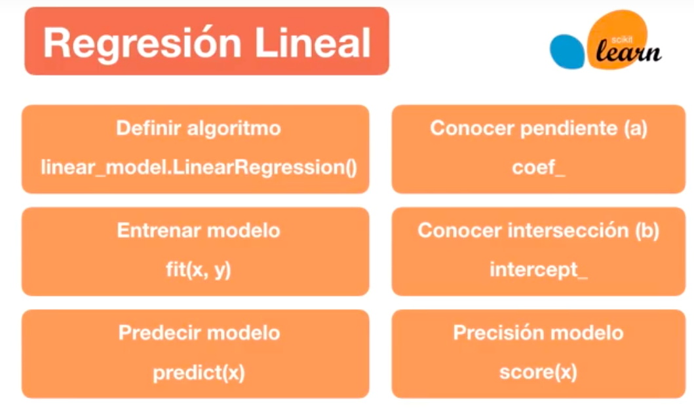
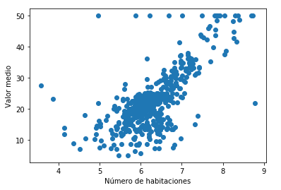
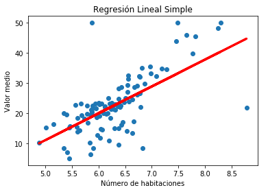
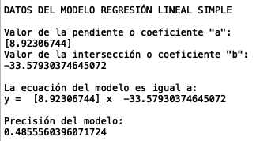

# Regresión Lineal con Scikit Learn

Los comandos a utilizar para implementar un algoritmo de Regresión Lineal son:

## Ejemplo de aplicación

Dataset utilizado:  [Boston Housing ](https://scikit-learn.org/stable/modules/generated/sklearn.datasets.load_boston.html#sklearn.datasets.load_boston)

### Distribución de los datos utilizandos:

### Resultados del modelo

