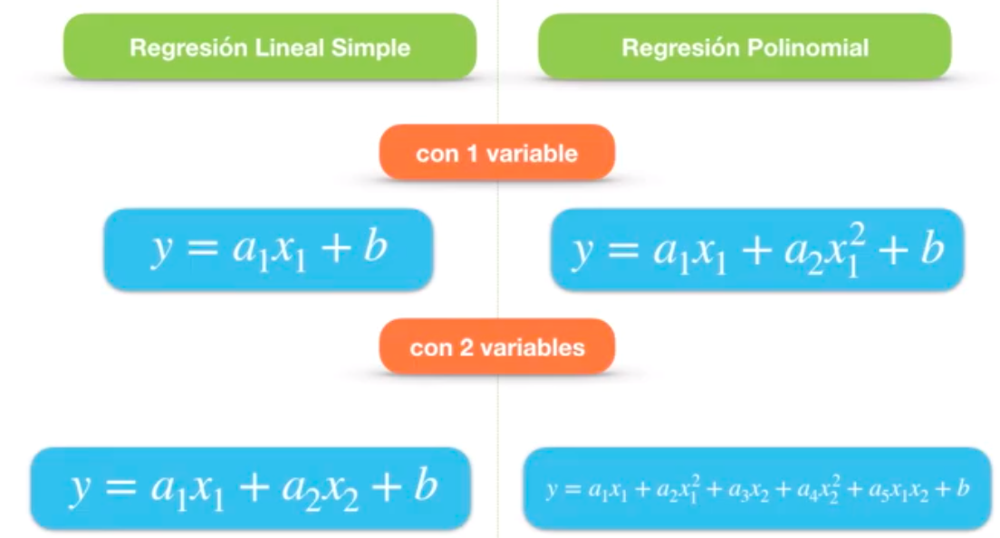
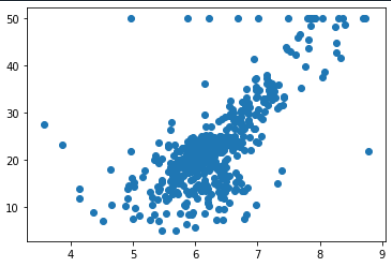
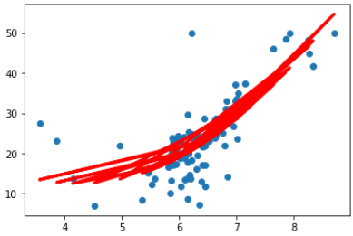

# Regresión Polinomial con Scikit Learn

Diferencia entre Regresión Lineal y Regresión pPolinomial:

## Ejemplo de aplicación

Dataset utilizado:  [Boston Housing ](https://scikit-learn.org/stable/modules/generated/sklearn.datasets.load_boston.html#sklearn.datasets.load_boston)

### Distribución de los datos utilizandos:

### Resultados del modelo

* Valor de la pendiente o coeficiente "a": [  0.         -17.90317352   2.11304933]

* Valor de la intersección o coeficiente "b": 50.40957418501222

* Precisión del modelo: 0.5301049115964992

Conclusión: Dado la distribución de los datos, este modelo no resulta conveniente.

