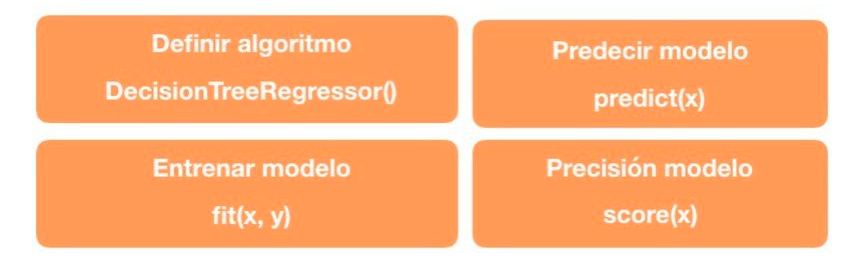
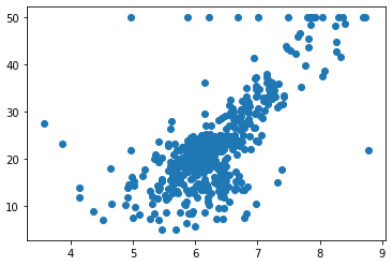
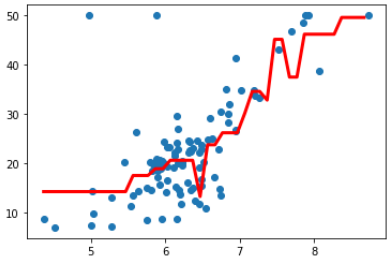

# Arboles de Decision Regresión con Scikit Learn

Funciones utilizadas de Scikit-Learn para el cálculo del modelo de Arboles de Decision Regresión:

## Ejemplo de aplicación

Dataset utilizado:  [Boston Housing ](https://scikit-learn.org/stable/modules/generated/sklearn.datasets.load_boston.html#sklearn.datasets.load_boston)

### Distribución de los datos utilizandos:

### Resultados del modelo

* Precisión del modelo: 0.6878258107331978

Conclusión: Dado la distribución de los datos, este modelo no resulta conveniente.

