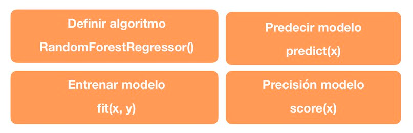
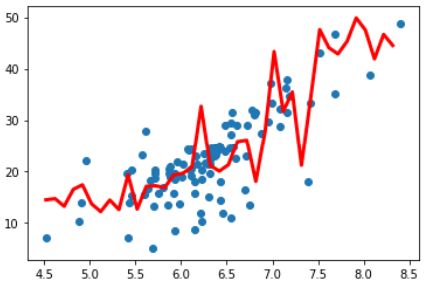

# Bosques Aleatorios Regresión con Scikit Learn

Funciones utilizadas de Scikit-Learn para el cálculo del modelo de 6. Bosques Aleatorios Regresión:

## Ejemplo de aplicación

Dataset utilizado:  [Boston Housing ](https://scikit-learn.org/stable/modules/generated/sklearn.datasets.load_boston.html#sklearn.datasets.load_boston)

### Distribución de los datos utilizandos:

### Resultados del modelo

* Precisión del modelo: 0.8173409931227442

Conclusión: Dado la distribución de los datos, este modelo arrojó un resultado aceptable.

