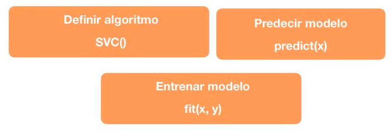

# SVM (Máquinas Vectores de Soporte) con Scikit Learn

Funciones utilizadas de Scikit-Learn para el cálculo del modelo de SVM

## Ejemplo de aplicación

Dataset utilizado:  [Breast Cancer ](https://scikit-learn.org/stable/modules/generated/sklearn.datasets.load_breast_cancer.html#sklearn.datasets.load_breast_cancer)

## Resultados del modelo

### Matriz de confusión: [[41  2][ 2 69]]

### Indices del modelo:

* Precisión del modelo: 0.971830985915493
