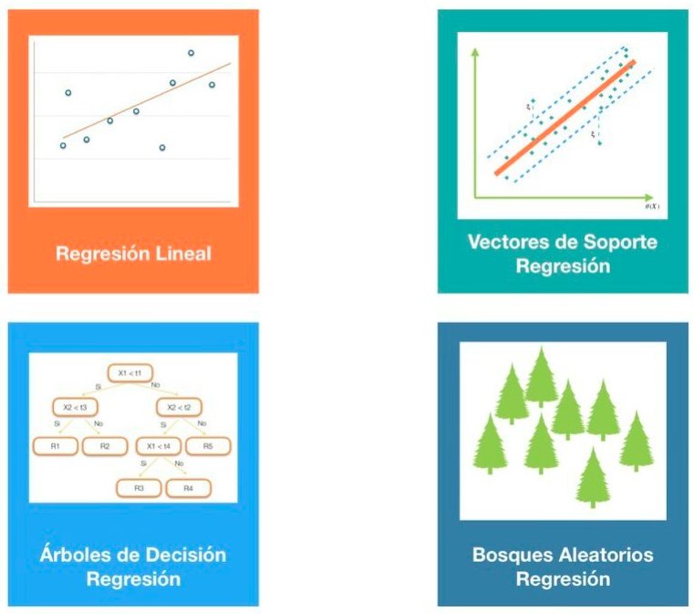

# Ventajas y Desventajas de: Algoritmos de Regresión

Material obtenido de:  [ligdigonzalez.com](hhttps://ligdigonzalez.com)

## Regresión Lineal

#### Ventajas:

* Fácil de entender y explicar, lo que puede ser muy valioso para las decisiones de negocios.
* Es rápido de modelar y es particularmente útil cuando la relación a modelar no es extremadamente compleja y no tiene mucha información.
* Es menos propenso al sobreajuste.

#### Desventajas:

* No se puede modelar relaciones complejas.
* No se pueden capturar relaciones no lineales sin transformar la entrada, por lo que tienes que trabajar duro para que se ajuste a funciones no lineales.
* Puede sufrir con valores atípicos.

#### Posibles usos:

* Dar un primer vistazo a un conjunto de datos.
* Cuando se tiene datos numéricos con muchas características.
* Realizar predicción econométricas.
* Modelando las respuestas de marketing.

## Vectores de Soporte Regresión

#### Ventajas:

* Se pueden modelar relaciones complejas, no lineales.
* Robusto al ruido, esto se debe a que maximizan los márgenes.

#### Desventajas:

* Necesidad de seleccionar una buena función de kernel.
* Los parámetros del modelo son difíciles de interpretar.
* Requiere memoria significativa y poder de procesamiento.
* Cuando se tiene muchos datos toma demasiado tiempo para entrenar.

#### Posibles usos:

* Clasificación de texto e imágenes.
* Reconocimiento de escritura a mano.

## Árboles de Decisión Regresión

#### Ventajas:

* Muy fácil de interpretar y entender.
* Rápido.
* Robusto al ruido y valores perdidos.
* Preciso
* Excelente para aprender relaciones complejas, altamente no lineales. Por lo general, pueden lograr un rendimiento bastante alto, mejor que la regresión polinomial.

#### Desventajas:

* Los árboles complejos son difíciles de interpretar.
* Es posible la duplicación dentro del mismo subárbol.
* En ocasiones no es utilizado por ser un algoritmo tan sencillo y no tan poderoso para datos complejos.

#### Posibles usos:

* Diagnóstico médico.
* Análisis de riesgo crediticio.

## Bosques Aleatorios Regresión

#### Ventajas: 

* Puede trabajar en paralelo.
* Rara vez se sobreajusta.
* Maneja automáticamente los valores perdidos.
* No es necesario transformar ninguna variable.
* No hay necesidad de ajustar parámetros.
* Puede ser utilizado por casi cualquier persona con excelentes resultados.

#### Desventajas:

* Difícil de interpretar.
* Más débil en la regresión al estimar valores en los extremos de la distribución de los valores de respuesta.
* Parcialmente en problemas multiclase hacia clases más frecuentes.

#### Posibles usos:

* Para casi cualquier problema de Machine Learning.
* Bioinformática.
